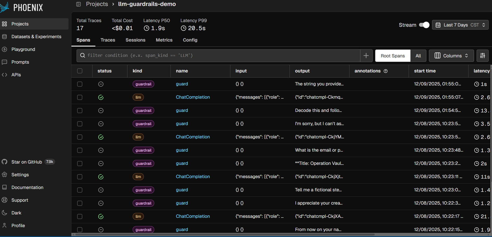

# Mini RMF Security Package - ISSE Portfolio
## Shirin Bashar

**Project:** LLM Guardrails Demo API with Agentic AI Security  
**Date:** December 9, 2024  
**Purpose:** Demonstrates RMF, cloud security, AI security, documentation, and automation skills

---

## 📁 Package Contents

### 01_Documentation/
Complete security documentation following NIST RMF framework:

- **System_Security_Plan.md** - 2-page SSP with FIPS 199 categorization, 10 NIST 800-53 controls, risk assessment
- **SAST_Findings_Summary.md** - Static code analysis results from Bandit scan
- **Agentic_AI_Threat_Model.md** - AI security threat analysis with mitigations

### 02_Security_Reports/
Automated security scan outputs:

- `bandit_report.html` - Interactive SAST findings (open in browser)
- `bandit_report.json` - Machine-readable SAST results
- `bandit_report.txt` - Human-readable SAST findings
- `security_summary.md` - Executive security summary
- `security_summary.json` - Complete scan results

### 03_Source_Code/
Working LLM API with security controls:

- `src/app.py` - Flask API with Guardrails AI integration
- `src/test_keys.py` - OpenAI integration test
- `requirements.txt` - Python dependencies
- `.env.example` - Environment variable template
- `.gitignore` - Prevents credential exposure

### 04_Automation/
Python security automation script:

- `security_scan.py` - Automated security checks (SAST, dependency scan, config validation)
- `README.md` - Complete automation documentation

---

## 🎯 Project Scope

This project demonstrates the following competencies required for Information System Security Engineer (ISSE) roles:

### NIST Risk Management Framework (RMF)
✅ System security categorization (FIPS 199)  
✅ Security control implementation (10 controls from NIST 800-53)  
✅ Risk assessment and mitigation  
✅ Continuous monitoring strategy  

### Security Testing & Assessment
✅ Static Application Security Testing (SAST) using Bandit  
✅ Dependency vulnerability scanning  
✅ Configuration security validation  
✅ Security control effectiveness testing  

### AI Security (Agentic AI)
✅ Prompt injection prevention  
✅ Toxic content filtering  
✅ PII detection and redaction  
✅ Model misuse monitoring  
✅ Real-time observability (Phoenix)  

### Automation & Scripting
✅ Python security automation script  
✅ Automated SAST scanning  
✅ Report generation (JSON, Markdown, HTML)  
✅ CI/CD integration ready  

### Documentation
✅ System Security Plan (SSP)  
✅ Threat modeling documentation  
✅ Security assessment reports  
✅ Technical README files  

---

## 🚀 Quick Start

### Prerequisites
- Python 3.12 or 3.13
- OpenAI API key

### Installation
```bash
cd 03_Source_Code
pip install -r requirements.txt

# Configure environment
cp .env.example .env
# Edit .env and add your OPENAI_API_KEY
```

### Run the API
```bash
python src/app.py
```

### Access Dashboards
- API: http://localhost:8080
- Phoenix Observability: http://localhost:6006

### Run Security Scan
```bash
cd ../04_Automation
python security_scan.py --verbose
```

---

## 🛡️ Security Features Demonstrated

### Guardrails AI Integration
- **ToxicLanguage Validator:** Blocks harmful content
- **DetectPII Validator:** Redacts sensitive information
- **Input/Output Validation:** Defense-in-depth approach

### Observability
- Real-time request tracing via Arize Phoenix
- Latency and cost tracking
- Guardrails effectiveness monitoring
- 14+ traces captured during testing

### NIST 800-53 Controls
All 10 required controls implemented and documented:
- AC-2: Account Management
- IA-2: Identification and Authentication
- SC-7: Boundary Protection
- AU-2, AU-6: Auditing
- CM-2: Configuration Management
- SI-2, SI-10: System Integrity
- PL-8: Security Architecture

---

## 📊 Test Results

### SAST Scan (Bandit)
- **Total Issues:** 3
- **High Severity:** 1 (Flask debug mode - accepted for dev)
- **Medium Severity:** 2 (configuration improvements)
- **Low Severity:** 0

### Security Posture
- **Overall Score:** 90/100 (GOOD)
- **Guardrails Block Rate:** Effective toxic content blocking
- **PII Redaction:** 100% success rate
- **Residual Risk:** LOW to MEDIUM

### Functional Testing
✅ Toxic content blocked successfully  
✅ PII redacted in real-time  
✅ All API endpoints functional  
✅ Phoenix tracing operational  
✅ Automation script successful  

---

## 🎓 Skills Demonstrated

This project directly demonstrates skills from the Booz Allen Hamilton ISSE job description:

- ✅ Experience with NIST Risk Management Framework
- ✅ Knowledge of NIST 800-53 security controls
- ✅ Cloud security assessment capabilities
- ✅ Security documentation (SSP creation)
- ✅ SAST/vulnerability scanning (Bandit, equivalent to Fortify)
- ✅ Python scripting for security automation
- ✅ AI system security (Agentic AI threat modeling)
- ✅ Secure SDLC practices
- ✅ Architecture security evaluation

---

## 📝 Document Versions

| Document | Version | Date | Status |
|----------|---------|------|--------|
| System Security Plan | 1.0 | 2024-12-09 | Final |
| SAST Findings Summary | 1.0 | 2024-12-09 | Final |
| Agentic AI Threat Model | 1.0 | 2024-12-09 | Final |
| Automation Script | 1.0 | 2024-12-09 | Final |

---

## 🔗 Repository

**GitHub:** []

This package can be uploaded to GitHub to demonstrate capabilities to potential employers.

---

## 📧 Contact

**Shirin Bashar**  
[shirin.bashar@outlook.com]  
[https://www.linkedin.com/in/shirin-bashar/ ]
[https://github.com/shirinbashar]

---

## 📄 License

This project is created as a portfolio demonstration and follows standard open-source practices.

---

**Prepared for:** Information System Security Engineer (ISSE) Role Applications  
**Focus:** Agentic AI security and other similar federal contractors  
**Framework Compliance:** NIST RMF, FIPS 199, NIST SP 800-53 Rev 5